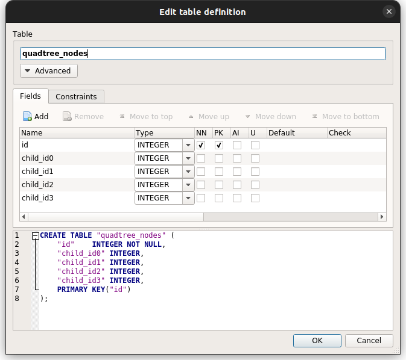
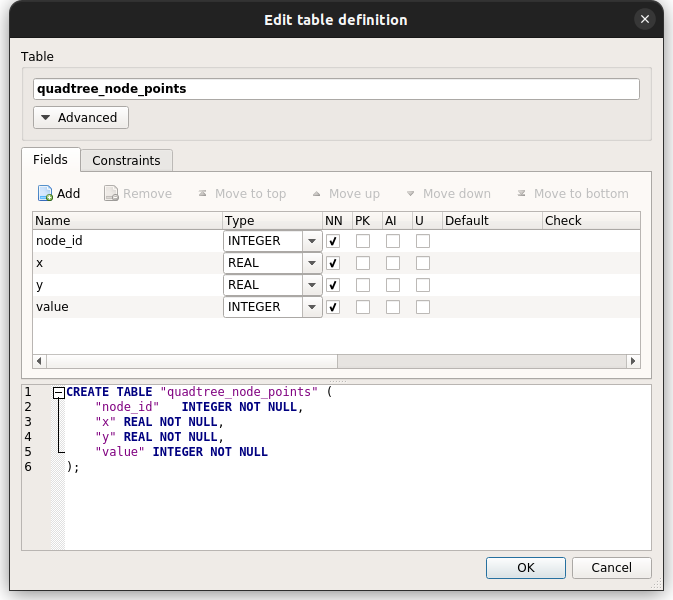

# MassivePoints

.NET implementation of modified QuadTree, perform faster range searches from very large number of multi-dimensional coordinates, with in-memory and database offloading.


# Status

[](https://www.repostatus.org/#wip)

|Target|Pakcage|
|:----|:----|
|Any|[](https://www.nuget.org/packages/MassivePoints)|

----

## What is this?

Have you ever tried to store a large amount of 2D/3D coordinate points and extract these from any given coordinate range?
Normally for such requests, we would use a GIS-compatible database system or service with complex management.

This library provides the ability to store and filter ranges of multi-dimensional coordinate points in the portable way.

It's very easy to use:

```csharp
using MassivePoints;

// Create QuadTree dictionary with 2D coordinate bound
// and pair of value type (string) on the memory.
double width = 100000.0;
double height = 100000.0;
IQuadTree<string> quadTree =
    QuadTree.Factory.Create<string>(width, height);

// Begin a session for update.
await using IQuadTreeSession<string> session =
    await quadTree.BeginSessionAsync(true);

// Insert a lot of random 2D coordinates.
var count = 1000000;
var r = new Random();
for (var index = 0; index < count; index++)
{
    double x = r.Next(0, width - 1);
    double y = r.Next(0, height - 1);
    await session.InsertPointAsync(
        new Point(x, y),    // x, y
        $"Point{index}");   // value
}

// Extract values by specifying 2D coordinate range.
double x0 = 30000.0;
double y0 = 40000.0;
double x1 = x0 + 35000.0;
double y1 = y0 + 23000.0;
foreach (PointItem<string> entry in
    await session.LookupBoundAsync(new Bound(x0, y0, x1, y1)))
{
    Console.WriteLine($"{entry.Point}: {entry.Value}");
}
```

It has the following features:

* Implements modified QuadTree coordinate search algorithm.
  * This algorithm stores multiple coordinate points as a linear list for each node in QuadTree.
  * A pure QuadTree has the problem of deeper node nesting, but with this method the nodes do not become deeply nested until they are filled.
  * Searching within a node is `O(n)`, but the CPU cache works absolutely faster in the in-memory data provider,
    and it is possible to speed up the process by using clever indexing on the database backend (of course, there are trade-offs).
* Included add a coordinate point, lookup and remove features.
* Supported multi-dimensional coordinate points.
  * By extending it to N-dimensions, you will be using a naturally extended algorithm,
    such as BinaryTree, QuadTree, OctaTree and more.
* Completely separates between QuadTree controller and data provider.
  * Builtin data providers: In-memory and ADO.NET.
  * Using the SQLite ADO.NET provider (System.Data.SQLite),
    it is possible to perform bulk inserts of 170,000 2D coordinate points per second in my environment.
* Fully asynchronous operation.
* Supported asynchronous streaming lookup (`IAsyncEnumerable<T>`).

### Target .NET platforms

* .NET 8.0 to 5.0
* .NET Core 3.1 to 2.0
* .NET Standard 2.1 and 2.0
* .NET Framework 4.8.1 to 4.6.1

----

## How to use

Install [MassivePoints](https://www.nuget.org/packages/MassivePoints) from NuGet.

### Create in-memory QuadTree

You can use the factory to easy to use QuadTree:

```csharp
using MassivePoints;

// Create QuadTree dictionary with 2D coordinate bound
// and pair of value type (string) on the memory.
double width = 100000.0;
double height = 100000.0;
IQuadTree<string> quadTree = QuadTree.Factory.
    Create<string>(width, height);          // TValue = string

// Create QuadTree (OctaTree) dictionary with 3D coordinate bound
// and pair of value type (string) on the memory.
double width = 100000.0;
double height = 100000.0;
double depth = 100000.0;
IQuadTree<string> octaTree = QuadTree.Factory.
    Create<string>(width, height, depth);   // TValue = string
```

If you want to use a dimension that goes over three dimensions, use `new Bound(...)` to specify it.

In all the cases discussed below, 2D coordinate points are used as examples.
However, please remember that you can use various overloads to express N-dimensional coordinates.

### Create QuadTree with ADO.NET provider

This sample code uses SQLite ADO.NET provider: [System.Data.SQLite](https://www.nuget.org/packages/System.Data.SQLite/)

```csharp
using MassivePoints;
using MassivePoints.Data;
using System.Data.SQLite;

// Open SQLite database.
var connectionString = new SQLiteConnectionStringBuilder()
{
    DataSource = "points.db",
}.ToString();

// Create QuadTree provider using SQLite database.
double width = 100000.0;   // 2D coordinate bound.
double height = 100000.0;
var provider = QuadTree.Factory.CreateProvider<string>(
    async () =>   // ADO.NET connection factory
    {
        var connection = new SQLiteConnection(connectionString);
        await connection.OpenAsync();
        return connection;
    },
    new DbDataProviderConfiguration(),
    new Bound(width, height));

// Setup the SQLite tables to be used with QuadTree.
await provider.CreateSQLiteTablesAsync(false);

// Create QuadTree dictionary.
IQuadTree<string> quadTree = QuadTree.Factory.Create(provider);
```

Even when using ADO.NET, it is possible to handle dimensions greater than three dimensions.
In this case, the database schema definition will also use a definition that supports N-dimensions.

When using SQLite, you can use `provider.CreateSQLiteTablesAsync(...)`
to automatically generate N-dimensional tables can be generated automatically.

The `DbDataProviderConfiguration` class provides customization points for use with various database systems.

### Begin a session

You have to use `BeginSessionAsync()` to start QuadTree manipulation:

```csharp
// Begin a reading session.
await using (IQuadTreeSession<string> session =
    await quadTree.BeginSessionAsync())
{
    // (Do lookup manipulation)
    await session.LookupPointAsync(...);
}
```

Or, use `BeginUpdateSessionAsync()` to start updating QuadTree manipulation:

```csharp
// Begin a update session.
await using (IQuadTreeUpdateSession<string> session =
    await quadTree.BeginUpdateSessionAsync())
{
    // (Do insert, lookup and remove manipulation)
    await session.InsertPointAsync(...);

    // Finish a session.
    await session.FinishAsync();
}
```

These methods can be categorized according to whether or not they perform an update process.
If use `BeginUpdateSessionAsync()`, the concurrent operation may fail.
Conversely if `BeginSessionAsync()`, concurrent operation is possible and multiple lookup operations may be performed simultaneously.

|Method|Lookup|Update: Insert,Remove|Concurrency|
|:----|:----|:----|:----|
|`BeginUpdateSessionAsync()`|Yes|Yes|No|
|`BeginSessionAsync()`|Yes|No|Yes|

Also, be sure to call `FinishAsync()` after any updates.
Depending on the backend data provider, the updates may be undone.

### Insert coordinate points

You can insert a coordinate point and a value to associate with it using `InsertPointAsync()`:

```csharp
// Insert a random 2D coordinate point.
var r = new Random();
Point point = new Point(r.Next(0, width - 1), r.Next(0, height - 1));
await session.InsertPointAsync(
    point,              // x, y
    $"Point{index}");   // value
```

If you want to insert a N-dimensional coordinate point,
you can use the overload of `new Point(x, y, z)` or others.

You can also perform other bulk inserts,
inserting a large number of coordinate points to faster with `InsertPointsAsync()`.

```csharp
// Insert a lot of random coordinates.
var count = 1000000;
var r = new Random();

await session.InsertPointsAsync(
    Enumerable.Range(0, count).
    Select(_ => PointItem.Create(   // Makes pair of a point and a value.
        r.Next(0, width - 1),    // x
        r.Next(0, height - 1),   // y
        $"Point{index}")));      // value
```

When performing bulk insertion,
use `PointItem<TValue>` to represent the pairs of values associated with the coordinate points.
As shown above, you can omit the generic type parameter by using `PointItem.Create(...)` method.

### Lookup coordinate points

With exact coordinate point by `LookupPointAsync()`:

```csharp
// Extract values by specifying a 2D coordinate point.
// There is a possibility that multiple values
// with the same coordinates will be extracted.

Point targetPoint = new Point(31234.0, 45678.0);

foreach (PointItem<string> entry in
    await session.LookupPointAsync(targetPoint))
{
    Console.WriteLine($"{entry.Point}: {entry.Value}");
}
```

With coordinate range by `LookupBoundAsync()`:

```csharp
// Extract values by specifying coordinate range.
Bound targetBound = new Bound(
    30000.0, 40000.0,                       // x0, y0
    30000.0 + 35000.0, 40000.0 + 23000.0);  // x1, y1 (exclusive, right-opened)

foreach (PointItem<string> entry in
    await session.LookupBoundAsync(targetBound))
{
    Console.WriteLine($"{entry.Point}: {entry.Value}");
}
```

Note that the coordinate range is right-open interval.

* ex: `[30000.0,40000.0 - 65000.0,63000.0)`

### Streaming lookup

MassivePoints supported `IAsyncEnumerable<T>` asynchronous streaming.
Use `EnumerateBoundAsync()`:

```csharp
// Extract values on asynchronous iterator.
Bound targetBound = new Bound(
    30000.0, 40000.0,                       // x0, y0
    30000.0 + 35000.0, 40000.0 + 23000.0);  // x1, y1 (exclusive, right-opened)

await foreach (PointItem<string> entry in
    session.EnumerateBoundAsync(targetBound))
{
    Console.WriteLine($"{entry.Point}: {entry.Value}");
}
```

Because of the streaming process, `EnumerateBoundAsync()` can enumerate even a huge set of coordinate points in the result without any problem.
However, be aware that its performance is not as good as that of `LookupBoundAsync()`.

### Remove coordinate points

With exact coordinate point by `RemovePointAsync()`:

```csharp
// Remove exact coordinate point.
Point targetPoint = new Point(31234.0, 45678.0);

long removed = await session.RemovePointAsync(targetPoint);
```

With coordinate range by `RemoveBoundAsync()`:

```csharp
// Remove coordinate range.
Bound targetBound = new Bound(
    30000.0, 40000.0,                       // x0, y0
    30000.0 + 35000.0, 40000.0 + 23000.0);  // x1, y1 (exclusive, right-opened)

long removed = await session.RemoveBoundAsync(targetBound);
```

----

## Advanced topics

### Node and node depth

TODO:

```csharp
// Insert a coordinate point to get node depth.
var nodeDepth = await session.InsertPointAsync(point, $"Point{index}");
```

TODO:

### Perform index shrinking

In the default configuration of MassivePoints,
even if you remove a coordinate point, the index will not be shrinked.

The index shrinking is a slow process because it is expensive to determine when shrinking is necessary.
While understanding this drawback, set the `performShrinking` argument to `true` as follows:

```csharp
// Remove coordinate range with index shrinking.
Bound targetBound = new Bound(
    30000.0, 40000.0,                       // x0, y0
    30000.0 + 35000.0, 40000.0 + 23000.0);  // x1, y1 (exclusive, right-opened)

long removed = await session.RemoveBoundAsync(
    targetBound, performShrinking: true);
```

### ADO.NET database schema

TODO:

MassivePoints provides a `provider.CreateSQLiteTablesAsync()` method that makes it easy to create tables for SQLite.

* [`CreateSQLiteTablesAsync()`](MassivePoints/Data/DbDataProviderExtension.cs)

Unfortunately, there is no way to define table definitions in a platform-neutral way in .NET, so this method is only for SQLite.
However, it can be used with different database systems by manually defining tables similar to the following schema.

Only the following two tables are required:

#### Node table

TODO:



#### Node-point table

TODO:




----

## TODO

* Additional xml comment and documents.
* Supports F# friendly interfaces.
* Added more useful helper methods.

## License

Apache-v2

## History

* 0.13.0:
  * Supported asynchronous factory for database connection.
* 0.12.0:
  * Fixed boundary coordinate precision on calculation for splitting.
  * Fixed the globe bound.
  * Added coordinate points validation process on sample code.
  * Added more xml comments.
* 0.11.0:
  * Added flush method.
  * Improved bulk insertion when the node already dense points.
  * Improved parallel distribution works.
  * Fixed infinite recursive calls when bulk insert count exceeds ceiling.
  * Distribution is not performed when coordinate points are inserted in excess of MaxNodePoints.
  * Added OpenStreetMap pbf insertion sample ([in the samples directory](samples/ImportOsmNode))
* 0.10.0:
  * Split session interface between updatable and readable.
  * Supported multi-dimensional coordinate points.
* 0.9.0:
  * Added bulk insert features.
  * Improved concurrency.
  * Implemented index shrinking.
* 0.8.0:
  * Initial release.
